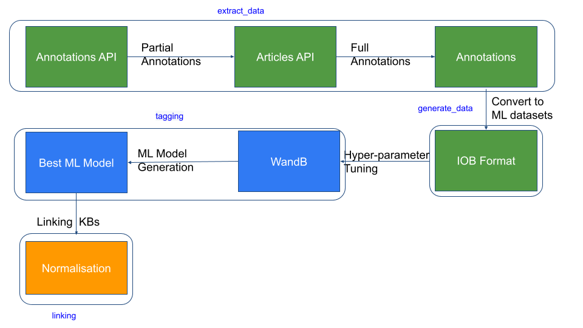

# CAPITAL

**CAPITAL** is a toolchain designed for extracting, generating, tagging, and linking scientific data from Europe PMC to various knowledge bases. It consists of four key stages: `extract_data`, `generate_data`, `tagging`, and `linking`. This README will guide you through the installation process, an overview of the stages, and how to get started.

## Table of Contents
- [Installation](#installation)
- [Stages](#stages)
  - [1. Extract Data](#1-extract-data)
  - [2. Generate Data](#2-generate-data)
  - [3. Tagging](#3-tagging)
  - [4. Linking](#4-linking)
- [Example Workflow](#example-workflow)
- [Contributors](#contributors)



---

## Installation

To install the dependencies for the entire pipeline, you can use the `requirements.txt` provided. Run the following command to install the required packages:

```bash
pip install -r requirements.txt
```

For individual components, refer to their respective folders for additional installation details and requirements.

Make sure to check for any duplicate dependencies before proceeding.

---

## Stages

### 1. Extract Data

This stage is used for extracting data from Europe PMC using both the **Annotation API** and the **Articles API**. The extracted data will serve as the input for the following stages.

[Code for Extract Data](https://github.com/ML4LitS/CAPITAL/tree/main/extract_data)

**Steps:**
- Retrieve annotations and articles from the Europe PMC APIs.
- Parse the data to prepare it for the next stage.

### 2. Generate Data

In this stage, the extracted data is converted into the appropriate format required for machine learning models. Specifically, the input `[sentence, [[token, ner, span_start, span_end],....]]]` format is transformed into **IOB format** for training the ML classifier.

[Code for Generate Data](https://github.com/ML4LitS/CAPITAL/tree/main/generate_data)

**Steps:**
- Convert tokenized sentences and named entity recognition (NER) data into IOB format.
- The output is prepared for training machine learning models in the tagging stage.

### 3. Tagging

This stage trains the machine learning classifier. We use HuggingFace libraries and models for the training process, along with Weights and Biases (wandb) for hyperparameter tuning and tracking.

[Code for Tagging](https://github.com/ML4LitS/CAPITAL/tree/main/tagging)

**Steps:**
- Train the ML classifier on the IOB-formatted data.
- Utilize HuggingFace models for NER.
- Perform hyperparameter tuning and tracking using `wandb`.

### 4. Linking

In the final stage, the machine learning classifier's tagged entities are linked to a knowledge base, creating connections between the identified entities and structured data resources.

[Code for Linking](https://github.com/ML4LitS/CAPITAL/tree/main/linking)

**Steps:**
- Link the tagged entities to a predefined knowledge base.
- Create relationships between the classified entities and external data sources.

---

## Example Workflow

Here’s a general overview of the workflow:

1. **Extract Data**: Use APIs to pull articles and annotations.
2. **Generate Data**: Convert the data into a suitable format for machine learning.
3. **Tagging**: Train and tune a classifier using the generated data.
4. **Linking**: Connect the entities tagged by the classifier to a knowledge base.

---

## Contributors

- [Contributor 1](https://github.com/contributor1)
- [Contributor 2](https://github.com/contributor2)

For more details, feel free to check the individual folders for each stage or reach out via GitHub Issues.
