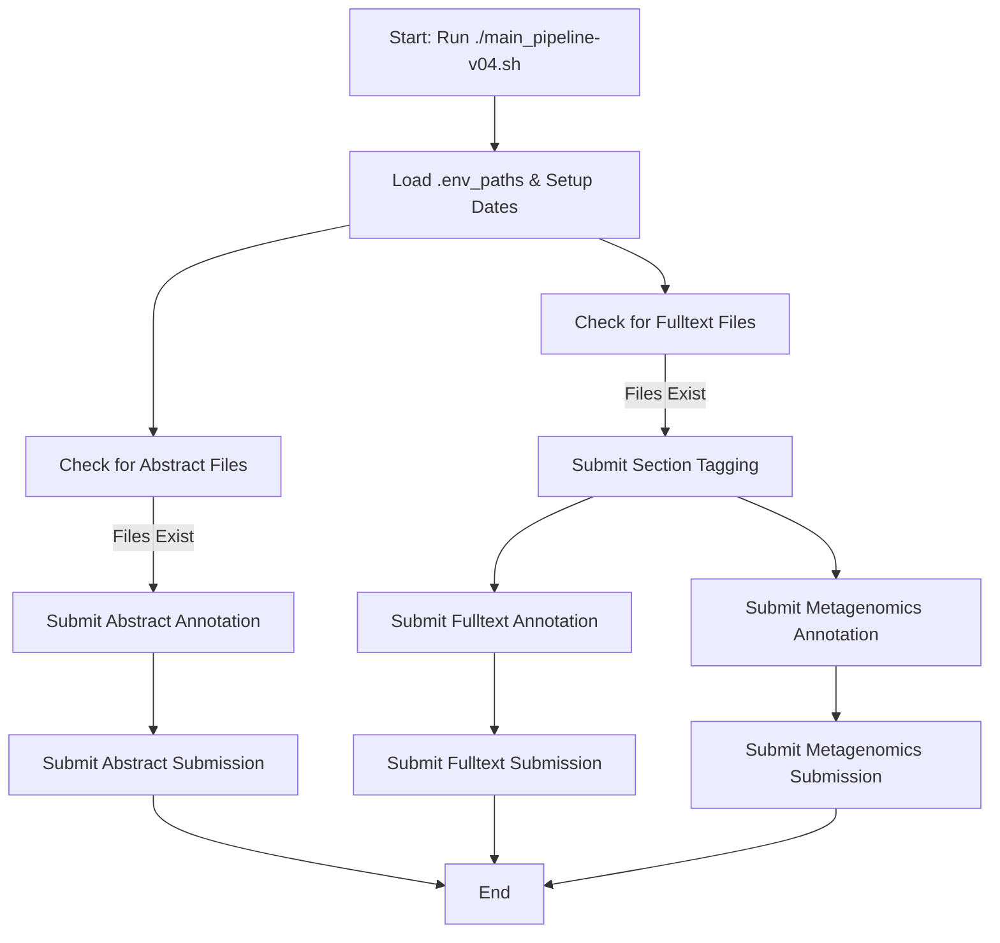

# 🧬 TextMining-ML Daily Pipeline

A daily literature mining pipeline to process abstracts and full-text articles with machine learning models for entity annotation, normalization, and submission.

---

## 📌 Usage

Run the pipeline by passing today’s date as an argument. It will process **yesterday’s articles**.

```bash
./main_pipeline-v04.sh "YYYY-MM-DD"
```

Example:
```bash
./main_pipeline-v04.sh "2025-06-04"
```

---

## ⚙️ Environment Setup

All paths are configured via `.env_paths`:

```bash
BASE_DIR="/hps/nobackup/literature/text-mining/daily_pipeline_api"
OUTPUT_BASE_DIR="/nfs/production/literature/santosh_tirunagari/textmining-ml"
LIB_PATH="/hps/software/users/literature/textmining-ml/lib"
MODEL_PATH_QUANTIZED="/hps/software/users/literature/textmining-ml/models/europepmc"
SPACY_MODEL_PATH="/hps/software/users/literature/textmining-ml/models/normalisation/en_floret_model"
BASE_DICTIONARY_PATH="/hps/software/users/literature/textmining-ml/models/normalisation/dictionary/"
```

These are sourced automatically at runtime.

---

## 🧱 Pipeline Structure

### 🟦 Abstract Pipeline

1. Locate `*.abstract.gz` files.
2. Run `abstract_annotation_tagger_worker.sh`.
3. Submit results via `submission_worker.sh`.

### 🟦 Fulltext Pipeline

1. Locate `patch-*.xml.gz` files.
2. Run `fulltext_section_tagger_worker.sh`.
3. After that, run:
   - `fulltext_annotation_tagger_worker.sh`
   - `metagenomics_fulltext_annotation_tagger_worker.sh`
4. Submit both annotations via `submission_worker.sh`.

---

## 🧠 Job Flow Logic



---

## 🔗 SLURM Job Dependencies

| Job                          | Dependent On            |
|-----------------------------|--------------------------|
| Abstract Submission         | Abstract Annotation     |
| Fulltext Annotation         | Section Tagger          |
| Metagenomics Annotation     | Section Tagger          |
| Fulltext Submission         | Fulltext Annotation     |
| Metagenomics Submission     | Metagenomics Annotation |

---

## 📁 Output Location

Processed files are saved in:

```
${OUTPUT_BASE_DIR}/${TODAY_OUTPUT}/[abstract|fulltext]/submission/
```

---

## ✅ Status

- [x] Abstract annotation
- [x] Fulltext annotation
- [x] Metagenomics tagging
- [x] Submission handling
- [x] SLURM job sequencing
- [x] Environment isolation via virtualenv
